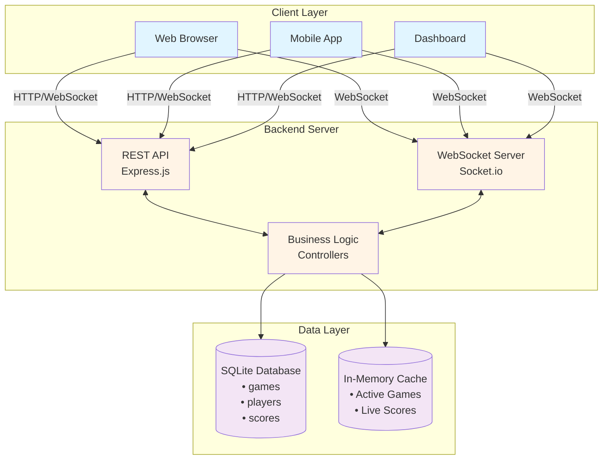
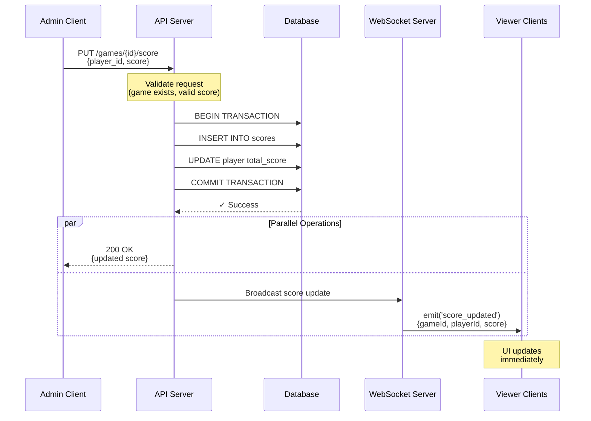
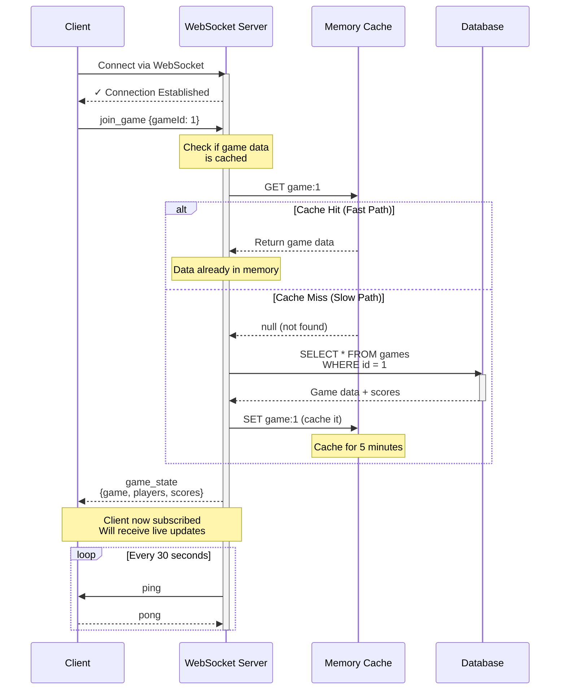
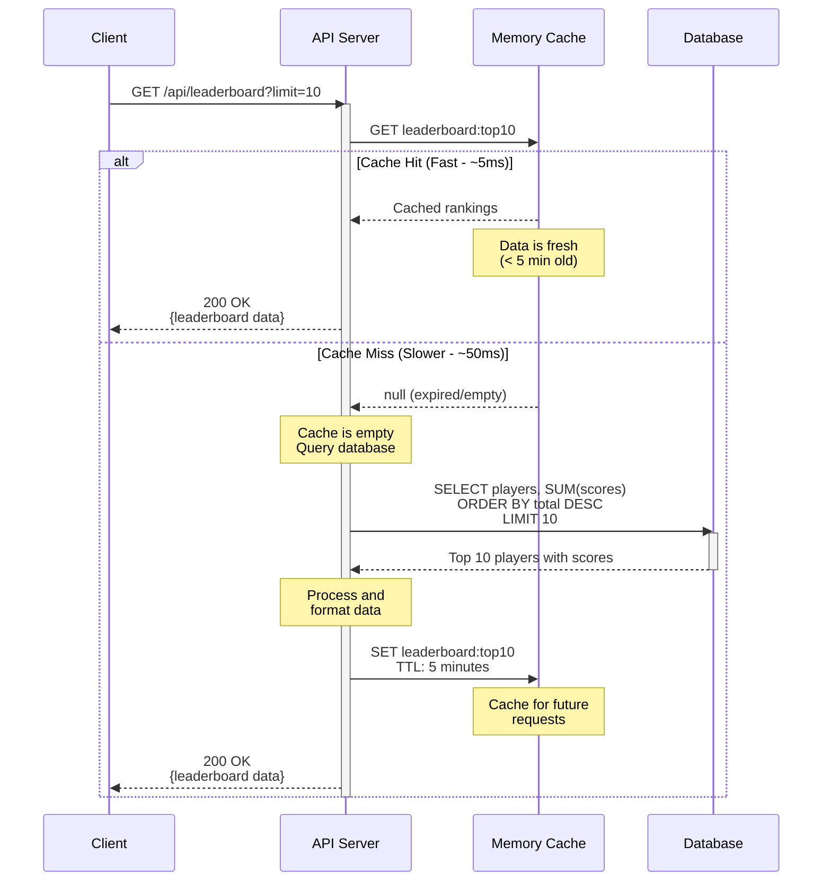
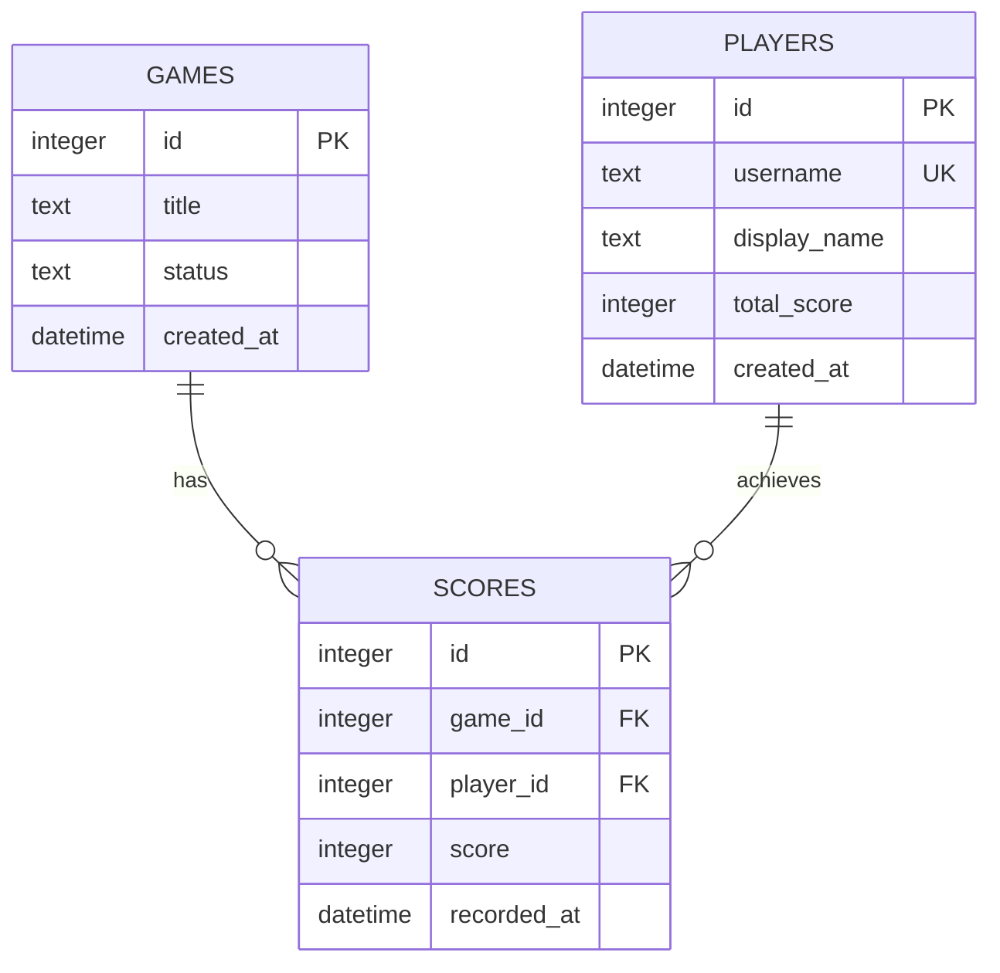
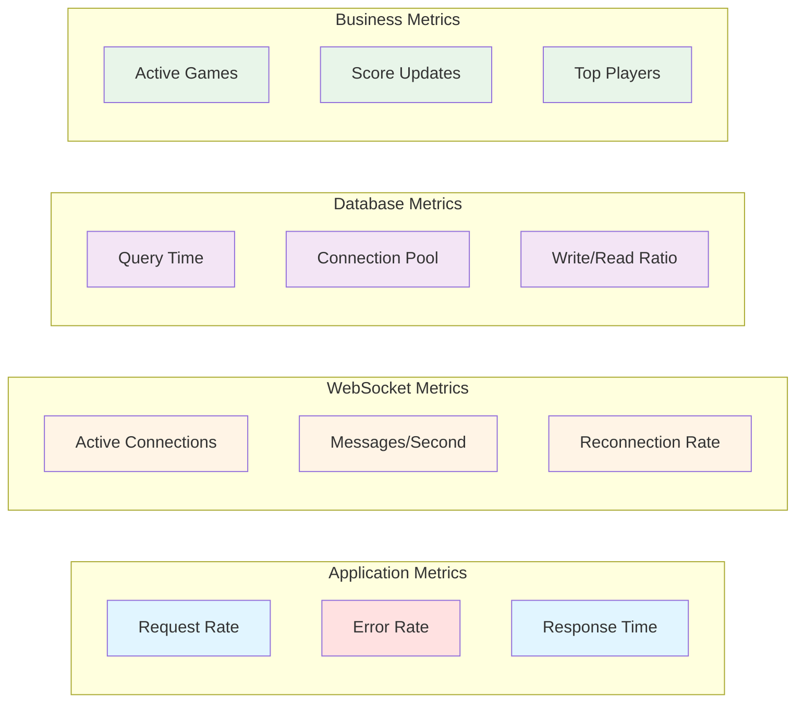
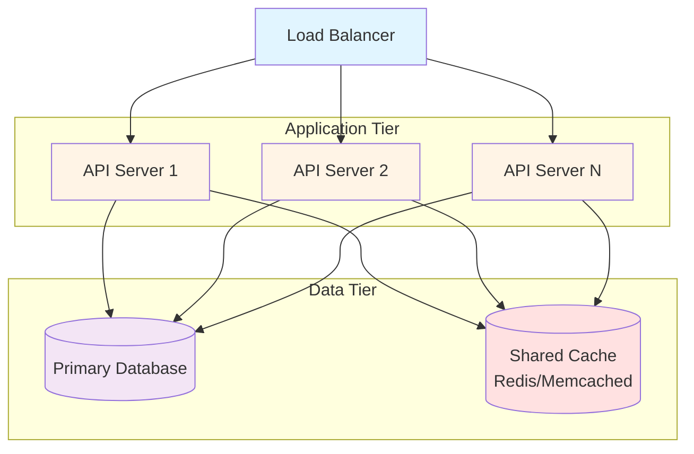

# Problem 6: Live Scoreboard Module - Architecture Documentation

## Table of Contents

1. [System Overview](#1-system-overview)
2. [Simple Architecture](#2-simple-architecture)
3. [Core Components](#3-core-components)
4. [Data Flow Diagrams](#4-data-flow-diagrams)
5. [Database Design](#5-database-design)
6. [API Design](#6-api-design)
7. [Implementation Guide](#7-implementation-guide)

---

## 1. System Overview

### Purpose

A real-time scoreboard system that displays live game scores and updates them instantly across all connected users. Think of it like a live sports scoreboard where everyone sees score changes immediately.

### Key Features

- ✅ **Real-time Updates**: Scores update instantly for all viewers
- ✅ **Multiple Games**: Track many games at once
- ✅ **Simple REST API**: Easy to integrate
- ✅ **WebSocket Support**: Live updates without refresh
- ✅ **Leaderboard**: Top players/teams ranking

### Target Use Cases

- Gaming leaderboards
- Sports score tracking
- Competition dashboards
- Tournament displays


---

## 2. Simple Architecture

### 2.1 System Architecture Diagram



**System Flow:**
1. **Client connects** → Server accepts HTTP/WebSocket connection
2. **Client subscribes** → Server adds client to game room
3. **Score update** → Server validates and saves to database
4. **Broadcast** → Server pushes update to all subscribed clients
5. **UI update** → Clients display new scores in real-time

### 2.2 Technology Stack

| Component | Technology | Why? |
|-----------|-----------|------|
| **Backend** | Node.js + Express | Fast, simple, JavaScript everywhere |
| **WebSocket** | Socket.io | Easy real-time communication |
| **Database** | SQLite | Simple, no setup needed |
| **Cache** | In-memory object | Fast access for active games |
| **Frontend** | React/Vue/Plain JS | Your choice |

---

## 3. Core Components

### 3.1 REST API Server

**Purpose**: Handle standard requests (create game, get scores, etc.)

**Endpoints**:
```
POST   /api/games           → Create new game
GET    /api/games/:id       → Get game details
PUT    /api/games/:id/score → Update score
GET    /api/leaderboard     → Get top scores
```

### 3.2 WebSocket Server

**Purpose**: Push real-time updates to clients

**Events**:
```
Client → Server:
  - join_game: Subscribe to game updates
  - leave_game: Unsubscribe from updates

Server → Client:
  - score_updated: When score changes
  - game_started: When game begins
  - game_ended: When game ends
```

### 3.3 Database

**Purpose**: Store all data permanently

**Tables**:
- `games` - Game information
- `players` - Player details
- `scores` - Score records

### 3.4 Memory Cache

**Purpose**: Quick access to active game data

**Stored**:
- Current game states
- Active player lists
- Live scores


---

## 4. Data Flow Diagrams

### 4.1 Score Update Flow

**Scenario:** Admin updates a player's score, and all viewers see it instantly



**Steps Explained:**
1. **Admin sends update** → API receives score change request
2. **Validation** → API checks game exists and score is valid
3. **Database transaction** → Save new score atomically
4. **Confirm save** → Database confirms successful write
5. **Dual response** → Return success to admin AND broadcast to viewers
6. **Real-time update** → All connected clients receive update via WebSocket
7. **UI refresh** → Clients display new score without page reload

### 4.2 Client Connection Flow

**Scenario:** User opens the scoreboard to watch a specific game



**Steps Explained:**
1. **Client connects** → WebSocket handshake established
2. **Join request** → Client wants to watch game #1
3. **Cache check** → Server looks in memory first (fast!)
4. **Cache hit** → If found, return immediately
5. **Cache miss** → If not in cache, query database
6. **Database query** → Fetch complete game state
7. **Cache update** → Store in cache for next request
8. **Send state** → Client receives current game information
9. **Subscription active** → Client will now get all live updates
10. **Heartbeat** → Regular ping/pong to keep connection alive

### 4.3 Leaderboard Query Flow

**Scenario:** User requests to see the top 10 players



**Cache Strategy:**
- **Cache Duration:** 5 minutes
- **Why Cache?** Leaderboard queries are expensive (aggregate across all scores)
- **Cache Invalidation:** Time-based (TTL) + manual on major score updates
- **Performance Gain:** 10x faster (5ms vs 50ms)

**Response Format:**
```json
{
  "leaderboard": [
    {"rank": 1, "username": "pro_player", "score": 15000, "games": 50},
    {"rank": 2, "username": "elite_gamer", "score": 12500, "games": 45}
  ],
  "updated_at": "2025-12-29T15:30:00Z",
  "cached": true
}
```


---

## 5. Database Design

### 5.1 Entity Relationship Diagram



**Relationships:**
- **One Game has Many Scores** → Each game contains multiple player scores
- **One Player achieves Many Scores** → Each player has scores across multiple games

### 5.2 Table Details

#### Games Table

```sql
CREATE TABLE games (
    id INTEGER PRIMARY KEY AUTOINCREMENT,
    title TEXT NOT NULL,
    status TEXT DEFAULT 'active',  -- 'active', 'completed'
    created_at DATETIME DEFAULT CURRENT_TIMESTAMP
);
```

**Example Data**:
```
id | title              | status    | created_at
---+--------------------+-----------+---------------------
1  | "Match #1"         | active    | 2025-12-29 10:00:00
2  | "Tournament Final" | completed | 2025-12-29 09:00:00
```

#### Players Table

```sql
CREATE TABLE players (
    id INTEGER PRIMARY KEY AUTOINCREMENT,
    username TEXT UNIQUE NOT NULL,
    display_name TEXT NOT NULL,
    total_score INTEGER DEFAULT 0,
    created_at DATETIME DEFAULT CURRENT_TIMESTAMP
);
```

**Example Data**:
```
id | username    | display_name | total_score | created_at
---+-------------+--------------+-------------+--------------------
1  | "player123" | "ProGamer"   | 15000       | 2025-12-29 08:00:00
2  | "ninja99"   | "Ninja99"    | 12500       | 2025-12-29 08:30:00
```

#### Scores Table

```sql
CREATE TABLE scores (
    id INTEGER PRIMARY KEY AUTOINCREMENT,
    game_id INTEGER NOT NULL,
    player_id INTEGER NOT NULL,
    score INTEGER DEFAULT 0,
    recorded_at DATETIME DEFAULT CURRENT_TIMESTAMP,
    FOREIGN KEY (game_id) REFERENCES games(id),
    FOREIGN KEY (player_id) REFERENCES players(id)
);

-- Index for fast queries
CREATE INDEX idx_game_scores ON scores(game_id, score DESC);
CREATE INDEX idx_player_scores ON scores(player_id);
```

**Example Data**:
```
id | game_id | player_id | score | recorded_at
---+---------+-----------+-------+---------------------
1  | 1       | 1         | 1000  | 2025-12-29 10:15:00
2  | 1       | 2         | 850   | 2025-12-29 10:15:00
3  | 1       | 1         | 1200  | 2025-12-29 10:20:00  (updated score)
```

### 5.3 Common Queries

**Get game with all player scores:**
```sql
SELECT 
    g.id as game_id,
    g.title,
    g.status,
    p.username,
    p.display_name,
    s.score,
    s.recorded_at
FROM games g
LEFT JOIN scores s ON g.id = s.game_id
LEFT JOIN players p ON s.player_id = p.id
WHERE g.id = 1
ORDER BY s.score DESC;
```

**Get top 10 players (leaderboard):**
```sql
SELECT 
    p.username,
    p.display_name,
    SUM(s.score) as total_score,
    COUNT(s.id) as games_played
FROM players p
LEFT JOIN scores s ON p.id = s.player_id
GROUP BY p.id
ORDER BY total_score DESC
LIMIT 10;
```

**Update player score:**
```sql
-- Add new score record
INSERT INTO scores (game_id, player_id, score) 
VALUES (1, 1, 1500);

-- Update player total
UPDATE players 
SET total_score = (SELECT SUM(score) FROM scores WHERE player_id = 1)
WHERE id = 1;
```


---

## 6. API Design

### 6.1 REST Endpoints

**Create a new game:**
```http
POST /api/games
Body: { "title": "Match #1" }

Response:
{
  "id": 1,
  "title": "Match #1",
  "status": "active"
}
```

**Update score:**
```http
PUT /api/games/1/score
Body: { 
  "player_id": 1, 
  "score": 1500 
}

Response:
{
  "game_id": 1,
  "player_id": 1,
  "score": 1500,
  "rank": 1
}
```

**Get game details:**
```http
GET /api/games/1

Response:
{
  "id": 1,
  "title": "Match #1",
  "status": "active",
  "players": [
    { "id": 1, "username": "player1", "score": 1500 },
    { "id": 2, "username": "player2", "score": 1200 }
  ]
}
```

**Get leaderboard:**
```http
GET /api/leaderboard?limit=10

Response:
{
  "leaderboard": [
    { "rank": 1, "username": "player1", "score": 15000 },
    { "rank": 2, "username": "player2", "score": 12500 }
  ]
}
```

### 6.2 WebSocket Events

**Client connects and joins game:**
```javascript
// Connect
socket.connect();

// Join a game
socket.emit('join_game', { gameId: 1 });

// Listen for score updates
socket.on('score_updated', (data) => {
  console.log('New score:', data);
  // { gameId: 1, playerId: 1, score: 1500 }
});
```

**Server broadcasts score update:**
```javascript
// When score changes
io.to('game_1').emit('score_updated', {
  gameId: 1,
  playerId: 1,
  score: 1500,
  rank: 1
});
```

---

## 7. Implementation Guide

### 7.1 Project Structure

```
scoreboard-api/
├── src/
│   ├── server.js              # Main application entry
│   ├── config/
│   │   └── database.js        # Database configuration
│   ├── routes/
│   │   ├── games.js          # Game endpoints
│   │   └── leaderboard.js    # Leaderboard endpoints
│   ├── controllers/
│   │   ├── gameController.js
│   │   └── scoreController.js
│   ├── models/
│   │   ├── Game.js
│   │   ├── Player.js
│   │   └── Score.js
│   ├── services/
│   │   └── cacheService.js   # In-memory caching
│   ├── websocket/
│   │   └── socketHandler.js  # WebSocket logic
│   └── utils/
│       ├── logger.js         # Logging utility
│       └── validators.js     # Input validation
├── tests/
│   ├── unit/
│   └── integration/
├── package.json
├── .env.example
├── .gitignore
└── README.md
```

### 7.2 Simple Server Setup

**server.js:**
```javascript
const express = require('express');
const http = require('http');
const socketIo = require('socket.io');

const app = express();
const server = http.createServer(app);
const io = socketIo(server);

app.use(express.json());

// REST API routes
app.use('/api/games', require('./routes/games'));
app.use('/api/leaderboard', require('./routes/leaderboard'));

// WebSocket connection
io.on('connection', (socket) => {
  console.log('Client connected');
  
  // Client joins game room
  socket.on('join_game', (data) => {
    socket.join(`game_${data.gameId}`);
  });
  
  socket.on('disconnect', () => {
    console.log('Client disconnected');
  });
});

// Make io accessible to routes
app.set('io', io);

server.listen(3000, () => {
  console.log('Server running on port 3000');
});
```

**database.js:**
```javascript
const sqlite3 = require('sqlite3').verbose();
const db = new sqlite3.Database('./scoreboard.db');

// Create tables
db.serialize(() => {
  db.run(`CREATE TABLE IF NOT EXISTS games (
    id INTEGER PRIMARY KEY AUTOINCREMENT,
    title TEXT NOT NULL,
    status TEXT DEFAULT 'active',
    created_at DATETIME DEFAULT CURRENT_TIMESTAMP
  )`);
  
  db.run(`CREATE TABLE IF NOT EXISTS players (
    id INTEGER PRIMARY KEY AUTOINCREMENT,
    username TEXT UNIQUE NOT NULL,
    display_name TEXT NOT NULL,
    total_score INTEGER DEFAULT 0
  )`);
  
  db.run(`CREATE TABLE IF NOT EXISTS scores (
    id INTEGER PRIMARY KEY AUTOINCREMENT,
    game_id INTEGER NOT NULL,
    player_id INTEGER NOT NULL,
    score INTEGER DEFAULT 0,
    recorded_at DATETIME DEFAULT CURRENT_TIMESTAMP
  )`);
});

module.exports = db;
```

**routes/games.js:**
```javascript
const express = require('express');
const router = express.Router();
const db = require('../database');

// Create game
router.post('/', (req, res) => {
  const { title } = req.body;
  
  db.run(
    'INSERT INTO games (title) VALUES (?)',
    [title],
    function(err) {
      if (err) return res.status(500).json({ error: err.message });
      
      res.json({
        id: this.lastID,
        title,
        status: 'active'
      });
    }
  );
});

// Update score
router.put('/:id/score', (req, res) => {
  const { id } = req.params;
  const { player_id, score } = req.body;
  
  // Save score
  db.run(
    'INSERT INTO scores (game_id, player_id, score) VALUES (?, ?, ?)',
    [id, player_id, score],
    function(err) {
      if (err) return res.status(500).json({ error: err.message });
      
      // Broadcast to all clients watching this game
      const io = req.app.get('io');
      io.to(`game_${id}`).emit('score_updated', {
        gameId: id,
        playerId: player_id,
        score: score
      });
      
      res.json({
        game_id: id,
        player_id: player_id,
        score: score
      });
    }
  );
});

// Get game details
router.get('/:id', (req, res) => {
  const { id } = req.params;
  
  db.all(
    `SELECT g.*, p.username, s.score
     FROM games g
     LEFT JOIN scores s ON g.id = s.game_id
     LEFT JOIN players p ON s.player_id = p.id
     WHERE g.id = ?`,
    [id],
    (err, rows) => {
      if (err) return res.status(500).json({ error: err.message });
      
      res.json({
        id: rows[0].id,
        title: rows[0].title,
        status: rows[0].status,
        players: rows.map(r => ({
          username: r.username,
          score: r.score
        }))
      });
    }
  );
});

module.exports = router;
```

### 7.3 Frontend Example

**HTML + JavaScript:**
```html
<!DOCTYPE html>
<html>
<head>
  <title>Live Scoreboard</title>
  <script src="/socket.io/socket.io.js"></script>
</head>
<body>
  <h1>Game Scoreboard</h1>
  <div id="scoreboard"></div>
  
  <script>
    const socket = io();
    
    // Join game #1
    socket.emit('join_game', { gameId: 1 });
    
    // Listen for score updates
    socket.on('score_updated', (data) => {
      console.log('Score updated!', data);
      updateScoreboard(data);
    });
    
    function updateScoreboard(data) {
      // Update the scoreboard display
      document.getElementById('scoreboard').innerHTML = 
        `Player ${data.playerId}: ${data.score} points`;
    }
    
    // Load initial scores
    fetch('/api/games/1')
      .then(res => res.json())
      .then(game => {
        game.players.forEach(player => {
          updateScoreboard({ 
            playerId: player.id, 
            score: player.score 
          });
        });
      });
  </script>
</body>
</html>
```


---

## 8. Production Considerations

### 8.1 Performance Metrics

**Target Performance:**

| Metric | Target | Measurement |
|--------|--------|-------------|
| API Response Time | < 100ms | p95 latency |
| WebSocket Message Delivery | < 50ms | Average |
| Concurrent Connections | 10,000+ | Per instance |
| Score Updates/Second | 1,000+ | Sustained throughput |
| Database Query Time | < 30ms | Average |
| Cache Hit Rate | > 80% | For leaderboards |

### 8.2 Error Handling

**Error Response Format:**
```json
{
  "success": false,
  "error": {
    "code": "INVALID_SCORE",
    "message": "Score must be a positive integer",
    "details": {
      "field": "score",
      "value": -100,
      "constraint": "score >= 0"
    }
  },
  "timestamp": "2025-12-29T15:30:00Z"
}
```

**Common Error Codes:**
- `GAME_NOT_FOUND` - Game ID doesn't exist
- `INVALID_SCORE` - Score validation failed
- `PLAYER_NOT_FOUND` - Player doesn't exist
- `DATABASE_ERROR` - Database operation failed
- `RATE_LIMIT_EXCEEDED` - Too many requests

### 8.3 Monitoring & Logging

**Key Metrics to Monitor:**



**Logging Strategy:**
```javascript
// Winston logger configuration
const winston = require('winston');

const logger = winston.createLogger({
  level: process.env.LOG_LEVEL || 'info',
  format: winston.format.combine(
    winston.format.timestamp(),
    winston.format.json()
  ),
  transports: [
    new winston.transports.File({ 
      filename: 'error.log', 
      level: 'error' 
    }),
    new winston.transports.File({ 
      filename: 'combined.log' 
    }),
    new winston.transports.Console({
      format: winston.format.simple()
    })
  ]
});

// Usage
logger.info('Score updated', {
  gameId: 1,
  playerId: 123,
  score: 1500,
  duration: 45 // ms
});
```

### 8.4 Security Best Practices

**Input Validation:**
```javascript
const validateScoreUpdate = (score) => {
  if (typeof score !== 'number') {
    throw new Error('Score must be a number');
  }
  if (score < 0) {
    throw new Error('Score cannot be negative');
  }
  if (score > 1000000) {
    throw new Error('Score exceeds maximum allowed value');
  }
  return true;
};
```

**Rate Limiting:**
```javascript
const rateLimit = require('express-rate-limit');

const apiLimiter = rateLimit({
  windowMs: 60 * 1000, // 1 minute
  max: 100, // 100 requests per minute
  message: 'Too many requests, please try again later'
});

app.use('/api/', apiLimiter);
```

**SQL Injection Prevention:**
```javascript
// ✅ GOOD - Using parameterized queries
db.run(
  'INSERT INTO scores (game_id, player_id, score) VALUES (?, ?, ?)',
  [gameId, playerId, score]
);

// ❌ BAD - String concatenation
db.run(
  `INSERT INTO scores VALUES (${gameId}, ${playerId}, ${score})`
);
```

### 8.5 Scaling Strategy

**Horizontal Scaling:**



**When to Scale:**
- CPU usage consistently > 70%
- Response time > 200ms
- WebSocket connections > 8,000 per instance
- Database query time > 50ms

**How to Scale:**
1. **Add more API servers** behind load balancer
2. **Implement Redis** for shared caching
3. **Database read replicas** for query distribution
4. **WebSocket server separation** for connection handling

### 8.6 Deployment Checklist

**Pre-Production:**
- [ ] Environment variables configured
- [ ] Database migrations tested
- [ ] Backup strategy in place
- [ ] Monitoring alerts configured
- [ ] Load testing completed
- [ ] Security audit passed
- [ ] Documentation updated
- [ ] API versioning implemented

**Production:**
- [ ] SSL/TLS certificates installed
- [ ] Rate limiting enabled
- [ ] CORS configured properly
- [ ] Health check endpoints active
- [ ] Logging level set appropriately
- [ ] Error tracking enabled (Sentry/Rollbar)
- [ ] Database backups automated
- [ ] Incident response plan documented

### 8.7 Health Check Endpoint

```javascript
app.get('/health', async (req, res) => {
  const health = {
    status: 'healthy',
    timestamp: new Date().toISOString(),
    uptime: process.uptime(),
    checks: {
      database: 'unknown',
      cache: 'unknown',
      websocket: 'unknown'
    }
  };
  
  try {
    // Check database
    await db.get('SELECT 1');
    health.checks.database = 'healthy';
    
    // Check cache
    if (cache.get('health-check')) {
      health.checks.cache = 'healthy';
    }
    
    // Check WebSocket
    health.checks.websocket = io.engine.clientsCount >= 0 ? 'healthy' : 'unhealthy';
    
    res.status(200).json(health);
  } catch (error) {
    health.status = 'unhealthy';
    health.error = error.message;
    res.status(503).json(health);
  }
});
```


---

## 9. Testing Strategy

### 9.1 Unit Tests

**Example Test Cases:**
```javascript
// Test score validation
describe('Score Validation', () => {
  test('should accept valid score', () => {
    expect(validateScore(1000)).toBe(true);
  });
  
  test('should reject negative score', () => {
    expect(() => validateScore(-100)).toThrow('Score cannot be negative');
  });
  
  test('should reject non-numeric score', () => {
    expect(() => validateScore('abc')).toThrow('Score must be a number');
  });
});

// Test leaderboard calculation
describe('Leaderboard Service', () => {
  test('should return top 10 players', async () => {
    const leaderboard = await getLeaderboard(10);
    expect(leaderboard.length).toBe(10);
    expect(leaderboard[0].rank).toBe(1);
  });
  
  test('should sort by total score descending', async () => {
    const leaderboard = await getLeaderboard(5);
    for (let i = 0; i < leaderboard.length - 1; i++) {
      expect(leaderboard[i].score).toBeGreaterThanOrEqual(
        leaderboard[i + 1].score
      );
    }
  });
});
```

### 9.2 Integration Tests

**API Endpoint Tests:**
```javascript
const request = require('supertest');
const app = require('../src/server');

describe('Game API', () => {
  test('POST /api/games - Create game', async () => {
    const response = await request(app)
      .post('/api/games')
      .send({ title: 'Test Game' })
      .expect(201);
    
    expect(response.body.id).toBeDefined();
    expect(response.body.title).toBe('Test Game');
  });
  
  test('PUT /api/games/:id/score - Update score', async () => {
    const response = await request(app)
      .put('/api/games/1/score')
      .send({ player_id: 1, score: 1500 })
      .expect(200);
    
    expect(response.body.score).toBe(1500);
  });
});
```

**WebSocket Tests:**
```javascript
const io = require('socket.io-client');

describe('WebSocket Events', () => {
  let socket;
  
  beforeEach((done) => {
    socket = io('http://localhost:3000');
    socket.on('connect', done);
  });
  
  afterEach(() => {
    socket.close();
  });
  
  test('should receive score update', (done) => {
    socket.emit('join_game', { gameId: 1 });
    
    socket.on('score_updated', (data) => {
      expect(data.gameId).toBe(1);
      expect(data.score).toBeDefined();
      done();
    });
    
    // Trigger score update
    updateScore(1, 1, 1500);
  });
});
```

### 9.3 Load Testing

**Using Artillery:**
```yaml
# artillery-config.yml
config:
  target: 'http://localhost:3000'
  phases:
    - duration: 60
      arrivalRate: 10
      name: "Warm up"
    - duration: 300
      arrivalRate: 50
      name: "Sustained load"
    - duration: 60
      arrivalRate: 100
      name: "Spike test"

scenarios:
  - name: "Score Update Flow"
    flow:
      - post:
          url: "/api/games/1/score"
          json:
            player_id: 1
            score: 1500
      - think: 2
      - get:
          url: "/api/games/1"
```

Run with: `artillery run artillery-config.yml`

### 9.4 Test Coverage Goals

| Component | Coverage Target |
|-----------|----------------|
| Controllers | > 80% |
| Services | > 90% |
| Models | > 85% |
| Utilities | > 95% |
| Overall | > 85% |

---

## 10. Summary & Recommendations

### Key Architecture Decisions

✅ **Simple & Scalable**
- Start with single server, scale horizontally when needed
- SQLite for development, PostgreSQL for production
- In-memory cache first, Redis later if needed

✅ **Real-Time Performance**
- WebSocket for instant updates
- Sub-100ms latency target
- Efficient database queries with indexes

✅ **Production Ready**
- Comprehensive error handling
- Logging and monitoring
- Health checks and metrics
- Security best practices

### Technology Choices Rationale

| Choice | Rationale |
|--------|-----------|
| **Node.js + Express** | Fast, JavaScript ecosystem, large community |
| **Socket.io** | Reliable WebSocket with automatic reconnection |
| **SQLite → PostgreSQL** | Easy development, production-grade database |
| **In-memory → Redis** | Simple start, scalable caching solution |

### Recommended Improvements for Scale

**Phase 1: Initial Deployment (MVP)**
- Single server with SQLite
- In-memory caching
- Basic monitoring
- Target: 1,000 concurrent users

**Phase 2: Growth (Scaling Up)**
- Migrate to PostgreSQL
- Add Redis caching layer
- Implement rate limiting
- Enhanced monitoring
- Target: 10,000 concurrent users

**Phase 3: Enterprise (Scaling Out)**
- Multiple API servers
- Load balancer
- Database read replicas
- CDN for static assets
- Auto-scaling
- Target: 100,000+ concurrent users

### Critical Success Factors

1. **Performance Monitoring** - Track response times, error rates
2. **Database Optimization** - Proper indexing, query optimization
3. **Caching Strategy** - Reduce database load by 80%+
4. **WebSocket Management** - Handle reconnections gracefully
5. **Testing** - Comprehensive unit and integration tests
6. **Documentation** - Keep API docs updated

---

## 11. API Reference

### Complete Endpoint List

| Method | Endpoint | Description | Auth Required |
|--------|----------|-------------|---------------|
| `GET` | `/health` | Health check | No |
| `POST` | `/api/games` | Create new game | Optional |
| `GET` | `/api/games/:id` | Get game details | No |
| `PUT` | `/api/games/:id/score` | Update player score | Yes |
| `GET` | `/api/leaderboard` | Get top players | No |

### WebSocket Events Reference

| Event | Direction | Payload | Description |
|-------|-----------|---------|-------------|
| `join_game` | Client → Server | `{gameId}` | Subscribe to game updates |
| `leave_game` | Client → Server | `{gameId}` | Unsubscribe from game |
| `score_updated` | Server → Client | `{gameId, playerId, score}` | Score changed |
| `game_started` | Server → Client | `{gameId}` | Game has started |
| `game_ended` | Server → Client | `{gameId, winner}` | Game completed |

---

## Appendix

### A. Environment Variables

```bash
# Server Configuration
PORT=3000
NODE_ENV=production
HOST=0.0.0.0

# Database
DATABASE_PATH=./data/scoreboard.db
DATABASE_MAX_CONNECTIONS=100

# Cache
CACHE_TTL=300
CACHE_MAX_SIZE=10000

# Logging
LOG_LEVEL=info
LOG_FILE=./logs/app.log

# WebSocket
WS_PING_INTERVAL=30000
WS_PING_TIMEOUT=5000

# Security
RATE_LIMIT_WINDOW=60000
RATE_LIMIT_MAX_REQUESTS=100
```

### B. Useful Commands

```bash
# Development
npm run dev              # Start development server
npm test                 # Run tests
npm run test:watch       # Run tests in watch mode
npm run test:coverage    # Generate coverage report

# Production
npm start                # Start production server
npm run migrate          # Run database migrations
npm run seed             # Seed database with test data

# Monitoring
npm run logs             # View application logs
npm run health           # Check system health
```

### C. Troubleshooting

**Problem:** WebSocket connections dropping
```bash
# Solution: Increase timeout values
WS_PING_INTERVAL=60000
WS_PING_TIMEOUT=10000
```

**Problem:** Database locked errors
```bash
# Solution: Enable WAL mode
PRAGMA journal_mode=WAL;
```

**Problem:** High memory usage
```bash
# Solution: Limit cache size
CACHE_MAX_SIZE=5000
```

---

**Document Version**: 2.0 (Production-Ready)  
**Last Updated**: December 29, 2025  
**Author**: Muhammad Amir Qushairi Jais  
**Review Status**: ✅ Ready for Implementation

**Next Steps:**
1. Review architecture with team
2. Set up development environment
3. Implement MVP (Phase 1)
4. Deploy to staging
5. Load testing and optimization
6. Production deployment


